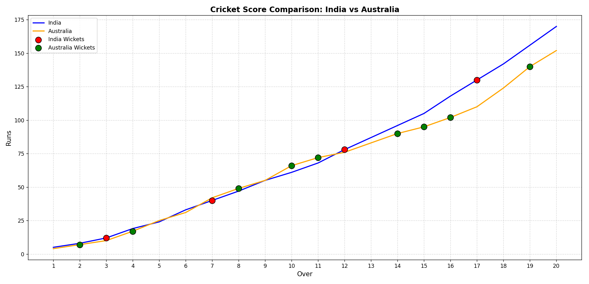

# 🏏 Cricket Score Plot – India vs Australia

This project visualizes the comparison of cricket scores between **India** and **Australia** over 20 overs using a line plot.

The visualization is done using:

- **Python**
- **Pandas** (for reading and handling the data)
- **Matplotlib** (for plotting the graph)

---

## 📂 Project Structure

CricketScoreAnalysis/
│
├── cricket_score.csv # Contains over-wise scores of India and Australia
├── cricket_analysis.py # Python code to generate the plot
└── README.md # Project documentation (this file)

## 📊 Chart Preview

